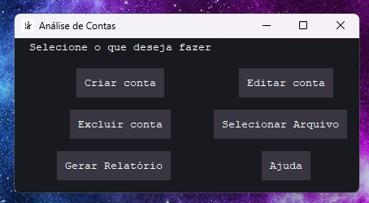
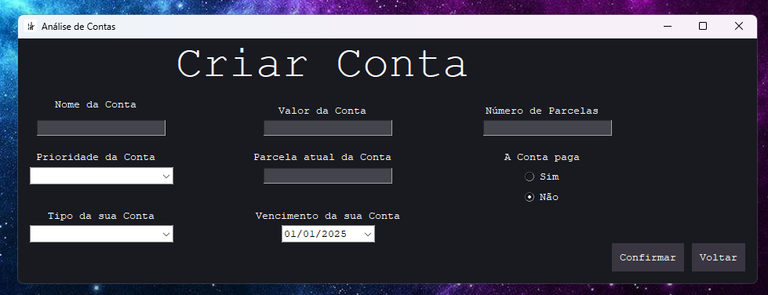

# Projeto de Análise de Contas 📈💰

## índice 🏹
- <a href='#introdução'>Introdução</a>
- <a href='#andamento-do-projeto'>Andamento do Projeto</a>
    - <a href='#página-inicial'>Página Inicial</a>
    - <a href='#página-de-criação-das-contas'>Página de Criação das Contas</a>
- <a href="#olá-eu-sou-o-lucas-👋">Sobre Mim</a>

## Introdução
Nesse projeto pretendo criar um programa que faça uma análise completa sobre as contas de uma casa, como por exemplo: contas de luz, água, cartão de crédito, etc. Quero que o programa deixe o usuário criar novas contas, editar contas e deletar as contas, para a criação da interface do programa pretendo usar o Tkinter. 

As contas devem conter as seguintes informações:
- Nome de identificação da conta
- Valor da conta
- Número de parcelas da conta (caso seja uma conta de uma única parcela esse valor é definido como 1)
- Prioridade da conta (esse valor vai de 1 a 10, sendo 1 a menor prioridade e 10 a maior)
- Parcela atual da conta (caso a conta tenha mais de uma parcela)
- Tipo da conta (por exemplo, força, água, cartão, mercado, lazer, etc)
- Opção de pago ou não
- Data de vencimento da conta

Depois que o usuário tiver adicionado todas as contas que ele deseja, elas ficam salvas em um arquivo chamado contas.csv, sendo assim caso o usuário queira refazer a mesma análise o programa já teria essas contas salvas, vale ressaltar que novas contas criadas futuramente também seram salvas no mesmo arquivo.

# Andamento do projeto

## Interface do projeto

### Página inicial

A página inicial é bem simples ela tem 6 botões: Criar de conta, Editar de conta, Excluir conta, 
um botão que gera os relatórios das contas que o usuário adicionou,
um botão para selecionar o arquivo contas.csv caso já tenha sido criado, um botão de ajuda que mostraria 
informações do projeto.

Cada botão redireciona para uma nova página que terá funções individuais.

### Página de criação das contas
Nessa página nós temos vários campos para a criação das contas, todos esses campos possuem formas de validação
individuais para poder entrar na nossa base de dados para a análise das contas.

Campo de Nome da Conta:

Nesse campo será o campo de identificação da conta, como por exemplo: Conta de Luz

Valor da Conta:

Nesse campo é o valor a ser pago da conta, nesse campo só pode existir números e a pessoa pode usar tanto pontos ou vírgulas para definir os centavos da conta

Prioridade da Conta:

Este campo será utilizado para definir a prioridade de pagamento da conta. O usuário poderá atribuir valores como "Alta", "Média" ou "Baixa" para organizar melhor as contas a serem pagas.

Número de Parcelas:

Neste campo, o usuário indicará o número total de parcelas relacionadas à conta. É um campo numérico, aceitando apenas números inteiros.

Parcela Atual da Conta:

Aqui o usuário poderá informar qual parcela está sendo registrada no momento, também utilizando apenas números inteiros. Isso ajuda no acompanhamento de pagamentos parcelados.

Tipo da sua Conta:

Este é um menu suspenso (dropdown) onde o usuário poderá selecionar o tipo da conta (por exemplo, "Essenciais", "Mercado", "Lazer", "Cartão de Crédito", etc.).

Vencimento da sua Conta:

Um campo para selecionar a data de vencimento da conta. O formato será de calendário, permitindo ao usuário escolher a data desejada de forma rápida e prática.

A Conta Paga:

Um conjunto de botões de opção (radio buttons) para indicar se a conta já foi paga ou não. O usuário deverá escolher entre "Sim" ou "Não", sendo que "Não" aparece como selecionado por padrão.

Botões Inferiores:

- Confirmar: Ao clicar neste botão, os dados preenchidos serão validados e caso estejam corretos serão salvos, e a conta será adicionada ao sistema, caso tenha algum dado errado a conta não será salvo e aparecerá mensagens de erro.
- Voltar: Este botão retorna o usuário para a tela inicial, sem salvar as informações preenchidas.

# Olá, eu sou o Lucas! 👋
Aos 20 anos, trilho meu caminho na Ciência de Dados com paixão pela programação. Com habilidades avançadas em Python e conhecimento intermediário em SQL, enfrento desafios com entusiasmo, especialmente na criação de inteligência artificial. Embora meu inglês seja inicial, estou dedicado aos estudos para aprimorá-lo. Estou aqui para aprender, crescer e deixar minha marca na interseção entre dados e inovação.

## Links para me contatar 🔗 

